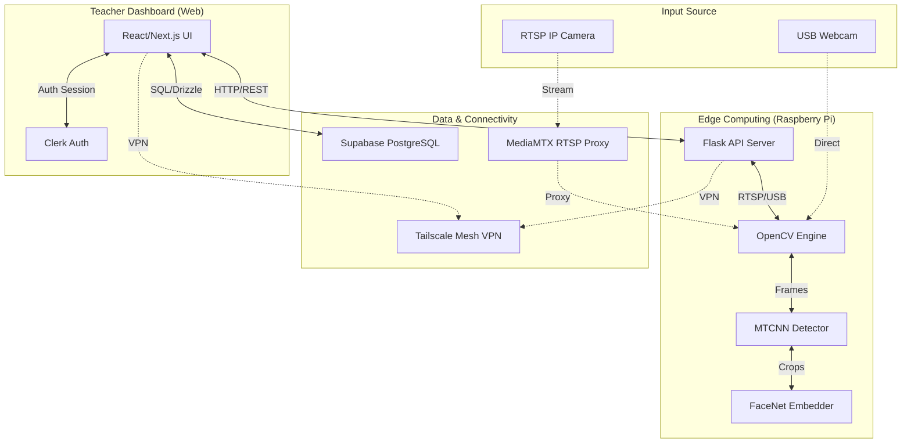
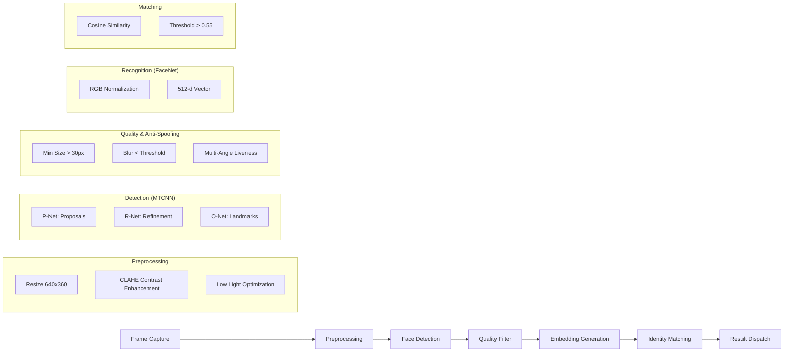

# System Architecture

## 1. High-Level Architecture
The system follows a distributed edge-cloud architecture, ensuring low-latency processing in the classroom while maintaining centralized data persistence.

---

## 2. Recognition Pipeline
This flow details the multi-stage AI process from a raw video frame to a recognized student identity.

---

## Detailed Components

### 1. Frontend Dashboard (React/Next.js)
The frontend serves as the Command & Control center.
- **Framework**: Next.js (React) with Tailwind CSS and Shadcn UI.
- **Authentication**: Clerk SDK (handles login, teacher roles, and onboarding).
- **State Management**: TanStack Query (React Query) for efficient API fetching and caching.
- **ORM**: Drizzle ORM for PostgreSQL interaction.
- **Responsibility**: 
    - Managing student records and enrollment.
    - Triggering attendance scans on the Raspberry Pi.
    - Displaying real-time attendance results and generating reports.

## 2. Edge API (Raspberry Pi / Python)
A lightweight Flask server running at the edge (in the classroom).
- **Core Engine**: Python 3.x with OpenCV.
- **Face Detection**: MTCNN (Multi-task Cascaded Convolutional Networks) for high-accuracy face bounding box detection.
- **Face Recognition**: FaceNet (InceptionResNetV1) for generating 512-dimensional face embeddings.
- **Optimization**: 
    - Batch processing of face embeddings for speed.
    - CLAHE enhancement for varying lighting conditions.
    - Laplacian blur filtering to skip poor-quality frames.
- **Responsibility**:
    - Capturing frames from RTSP/USB cameras.
    - Detecting faces and calculating embeddings.
    - Performing cosine similarity matching against a provided student list.

## 3. Cloud Infrastructure
- **Database**: Supabase (PostgreSQL) stores student data, face embeddings (JSONB), and attendance logs.
- **Connectivity**: Tailscale provides a secure, zero-config VPN (Mesh Network) between the Teacher's Laptop, Raspberry Pi, and the Internet.
- **Deployment**: The frontend is deployed on Vercel, while the Python API runs locally on the Pi.

---

## Communication Protocols
- **HTTP/REST**: Used for all command-and-control communication between Frontend and Pi.
- **RTSP/RTSPS**: Used by the Pi to pull real-time video streams from IP cameras.
- **JSON**: Standard data format for exchanging student embeddings and recognition results.
