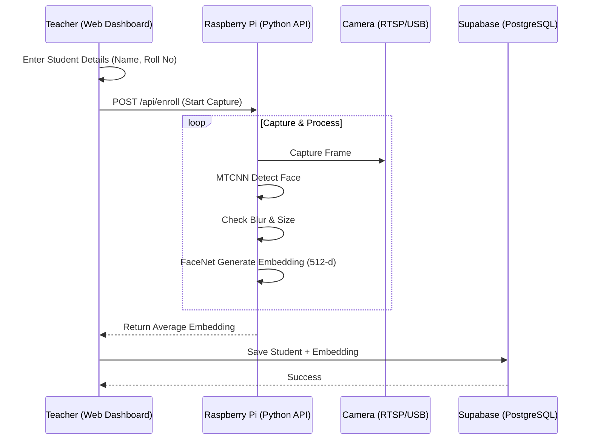
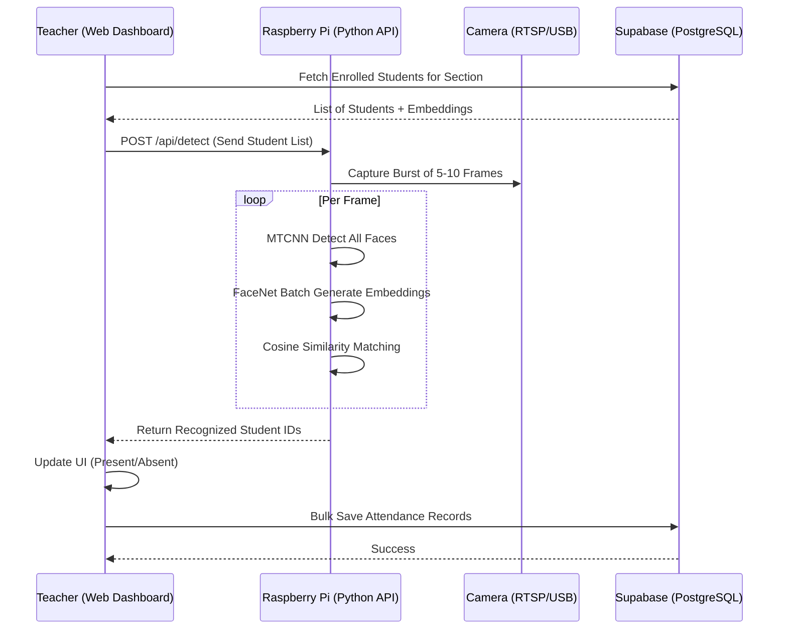

# System Flow Diagrams

## 1. Student Enrollment Flow
This flow describes how a new student's face is registered into the system.



---

## 2. Attendance Detection Flow
This flow describes the automated attendance process during a class.



---

## 3. Connectivity Flow (Remote/Hotspot)
This flow describes how the system maintains connectivity in a remote setup.

```mermaid
graph TD
    subgraph "Local Network (Remote Site)"
        CAM[RTSP Camera] -- Ethernet -- L[Teacher Laptop]
    end

    subgraph "Tailscale Mesh Network"
        L -- "Hotspot (WiFi)" -- P[Raspberry Pi]
        L -- "Internet" -- S[Supabase/Clerk]
        P -- "Internet" -- S
    end

    subgraph "Data Path"
        CAM -- "RTSP Stream" --> L
        L -- "MediaMTX Proxy" --> P
        P -- "Recognition Results" --> L
        L -- "SQL/HTTPS" --> S
    end
```
