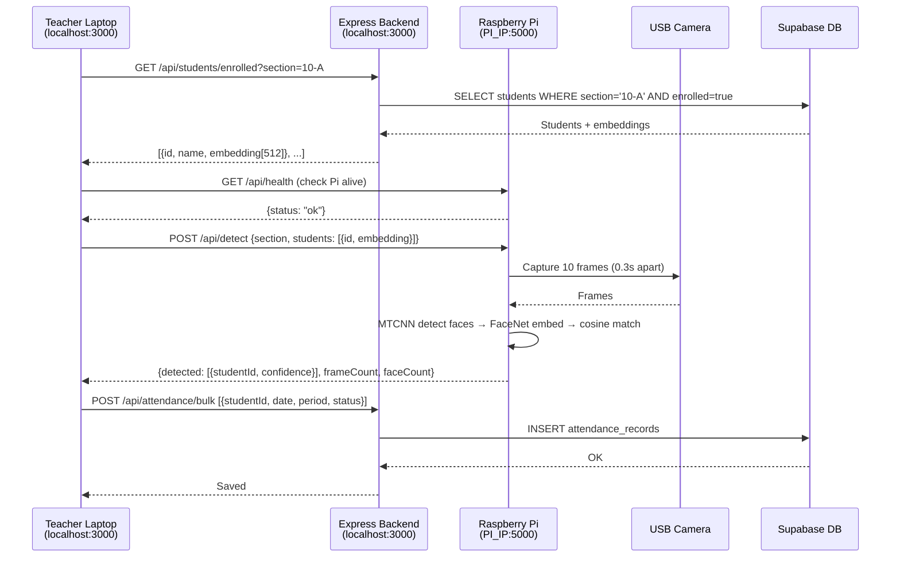

# AI Classroom Attendance System — Walkthrough

## What Was Fixed

### Bug 1: Port Conflict
Frontend Express server defaulted to port `5000`, conflicting with the Pi's Flask API which also uses `5000`. Changed to `3000`.

```diff:index.ts
import "dotenv/config";
import express, { type Request, Response, NextFunction } from "express";
import { registerRoutes } from "./routes";
import { serveStatic } from "./static";
import { createServer } from "http";

const app = express();
const httpServer = createServer(app);

declare module "http" {
  interface IncomingMessage {
    rawBody: unknown;
  }
}

app.use(
  express.json({
    limit: "50mb",
    verify: (req, _res, buf) => {
      req.rawBody = buf;
    },
  }),
);

app.use(express.urlencoded({ extended: false }));

export function log(message: string, source = "express") {
  const formattedTime = new Date().toLocaleTimeString("en-US", {
    hour: "numeric",
    minute: "2-digit",
    second: "2-digit",
    hour12: true,
  });

  console.log(`${formattedTime} [${source}] ${message}`);
}

app.use((req, res, next) => {
  const start = Date.now();
  const path = req.path;
  let capturedJsonResponse: Record<string, any> | undefined = undefined;

  const originalResJson = res.json;
  res.json = function (bodyJson, ...args) {
    capturedJsonResponse = bodyJson;
    return originalResJson.apply(res, [bodyJson, ...args]);
  };

  res.on("finish", () => {
    const duration = Date.now() - start;
    if (path.startsWith("/api")) {
      let logLine = `${req.method} ${path} ${res.statusCode} in ${duration}ms`;
      if (capturedJsonResponse) {
        logLine += ` :: ${JSON.stringify(capturedJsonResponse)}`;
      }

      log(logLine);
    }
  });

  next();
});

(async () => {
  const { seedDatabase } = await import("./seed");
  try {
    await seedDatabase();
  } catch (err) {
    console.error(err);
  }
  await registerRoutes(httpServer, app);

  app.use((err: any, _req: Request, res: Response, next: NextFunction) => {
    const status = err.status || err.statusCode || 500;
    const message = err.message || "Internal Server Error";

    console.error("Internal Server Error:", err);

    if (res.headersSent) {
      return next(err);
    }

    return res.status(status).json({ message });
  });

  // importantly only setup vite in development and after
  // setting up all the other routes so the catch-all route
  // doesn't interfere with the other routes
  if (process.env.NODE_ENV === "production") {
    serveStatic(app);
  } else {
    const { setupVite } = await import("./vite");
    await setupVite(httpServer, app);
  }

  // ALWAYS serve the app on the port specified in the environment variable PORT
  // Other ports are firewalled. Default to 5000 if not specified.
  // this serves both the API and the client.
  // It is the only port that is not firewalled.
  const port = parseInt(process.env.PORT || "5000", 10);
  httpServer.listen(
    {
      port,
      host: "127.0.0.1",
    },
    () => {
      log(`serving on port ${port}`);
    },
  );
})();
===
import "dotenv/config";
import express, { type Request, Response, NextFunction } from "express";
import { registerRoutes } from "./routes";
import { serveStatic } from "./static";
import { createServer } from "http";

const app = express();
const httpServer = createServer(app);

declare module "http" {
  interface IncomingMessage {
    rawBody: unknown;
  }
}

app.use(
  express.json({
    limit: "50mb",
    verify: (req, _res, buf) => {
      req.rawBody = buf;
    },
  }),
);

app.use(express.urlencoded({ extended: false }));

export function log(message: string, source = "express") {
  const formattedTime = new Date().toLocaleTimeString("en-US", {
    hour: "numeric",
    minute: "2-digit",
    second: "2-digit",
    hour12: true,
  });

  console.log(`${formattedTime} [${source}] ${message}`);
}

app.use((req, res, next) => {
  const start = Date.now();
  const path = req.path;
  let capturedJsonResponse: Record<string, any> | undefined = undefined;

  const originalResJson = res.json;
  res.json = function (bodyJson, ...args) {
    capturedJsonResponse = bodyJson;
    return originalResJson.apply(res, [bodyJson, ...args]);
  };

  res.on("finish", () => {
    const duration = Date.now() - start;
    if (path.startsWith("/api")) {
      let logLine = `${req.method} ${path} ${res.statusCode} in ${duration}ms`;
      if (capturedJsonResponse) {
        logLine += ` :: ${JSON.stringify(capturedJsonResponse)}`;
      }

      log(logLine);
    }
  });

  next();
});

(async () => {
  const { seedDatabase } = await import("./seed");
  try {
    await seedDatabase();
  } catch (err) {
    console.error(err);
  }
  await registerRoutes(httpServer, app);

  app.use((err: any, _req: Request, res: Response, next: NextFunction) => {
    const status = err.status || err.statusCode || 500;
    const message = err.message || "Internal Server Error";

    console.error("Internal Server Error:", err);

    if (res.headersSent) {
      return next(err);
    }

    return res.status(status).json({ message });
  });

  // importantly only setup vite in development and after
  // setting up all the other routes so the catch-all route
  // doesn't interfere with the other routes
  if (process.env.NODE_ENV === "production") {
    serveStatic(app);
  } else {
    const { setupVite } = await import("./vite");
    await setupVite(httpServer, app);
  }

  // ALWAYS serve the app on the port specified in the environment variable PORT
  // Other ports are firewalled. Default to 5000 if not specified.
  // this serves both the API and the client.
  // It is the only port that is not firewalled.
  const port = parseInt(process.env.PORT || "3000", 10);
  httpServer.listen(
    {
      port,
      host: "127.0.0.1",
    },
    () => {
      log(`serving on port ${port}`);
    },
  );
})();
```

### Bug 2: Route Ordering
`GET /api/students/enrolled` was registered after `GET /api/students/:id`, so Express matched `enrolled` as an `:id`. Fixed by reordering.

```diff:routes.ts
import type { Express, Request } from "express";
import { type Server } from "http";
import { storage } from "./storage";
import { clerkMiddleware, getAuth, requireAuth, createClerkClient } from "@clerk/express";
import { insertStudentSchema, insertAttendanceSchema, insertTimetableSlotSchema } from "@shared/schema";
import { z } from "zod";
import { seedTimetable } from "./seed";

const clerk = createClerkClient({
  secretKey: process.env.CLERK_SECRET_KEY!,
  publishableKey: process.env.VITE_CLERK_PUBLISHABLE_KEY!,
});

function getDayOfWeekFromDate(dateStr: string): number {
  const date = new Date(dateStr + "T00:00:00");
  const jsDay = date.getDay();
  return jsDay === 0 ? 6 : jsDay - 1;
}

const ADMIN_EMAILS = ["naeem542005@gmail.com", "yugankamble@gmail.com"];

async function isAdmin(userId: string): Promise<boolean> {
  try {
    const user = await clerk.users.getUser(userId);
    if (user.publicMetadata?.role === "admin") return true;
    const email = user.emailAddresses?.[0]?.emailAddress;
    if (email && ADMIN_EMAILS.includes(email.toLowerCase())) {
      await clerk.users.updateUserMetadata(userId, {
        publicMetadata: { ...user.publicMetadata, role: "admin", status: "approved" },
      });
      return true;
    }
    return false;
  } catch {
    return false;
  }
}

export async function registerRoutes(
  httpServer: Server,
  app: Express
): Promise<Server> {
  app.use(clerkMiddleware({
    publishableKey: process.env.VITE_CLERK_PUBLISHABLE_KEY,
    secretKey: process.env.CLERK_SECRET_KEY,
  }));

  app.get("/api/students", requireAuth(), async (req, res) => {
    try {
      const section = req.query.section as string | undefined;
      const result = section
        ? await storage.getStudentsBySection(section)
        : await storage.getStudents();
      res.json(result);
    } catch (error: any) {
      res.status(500).json({ message: error.message });
    }
  });

  app.get("/api/students/:id", requireAuth(), async (req: Request<{ id: string }>, res) => {
    try {
      const student = await storage.getStudent(req.params.id);
      if (!student) return res.status(404).json({ message: "Student not found" });
      res.json(student);
    } catch (error: any) {
      res.status(500).json({ message: error.message });
    }
  });

  app.post("/api/students", requireAuth(), async (req, res) => {
    try {
      const data = insertStudentSchema.parse(req.body);
      const student = await storage.createStudent(data);
      res.status(201).json(student);
    } catch (error: any) {
      res.status(400).json({ message: error.message });
    }
  });

  app.patch("/api/students/:id/enrollment", requireAuth(), async (req: Request<{ id: string }>, res) => {
    try {
      const { enrolled } = req.body;
      const student = await storage.updateStudentEnrollment(req.params.id, enrolled);
      if (!student) return res.status(404).json({ message: "Student not found" });
      res.json(student);
    } catch (error: any) {
      res.status(500).json({ message: error.message });
    }
  });

  // Store face embedding from Pi enrollment
  app.patch("/api/students/:id/embedding", requireAuth(), async (req: Request<{ id: string }>, res) => {
    try {
      const { embedding } = req.body;
      if (!embedding || !Array.isArray(embedding)) {
        return res.status(400).json({ message: "embedding array required" });
      }
      const student = await storage.updateStudentEmbedding(req.params.id, embedding);
      if (!student) return res.status(404).json({ message: "Student not found" });
      res.json(student);
    } catch (error: any) {
      res.status(500).json({ message: error.message });
    }
  });

  // Get enrolled students with embeddings for a section (used by attendance detect)
  app.get("/api/students/enrolled", requireAuth(), async (req, res) => {
    try {
      const section = req.query.section as string;
      if (!section) return res.status(400).json({ message: "section required" });
      const result = await storage.getStudentsWithEmbeddings(section);
      res.json(result);
    } catch (error: any) {
      res.status(500).json({ message: error.message });
    }
  });

  app.get("/api/attendance", requireAuth(), async (req, res) => {
    try {
      const auth = getAuth(req);
      const teacherId = auth.userId!;
      const { date, period } = req.query;
      if (!date || !period) {
        return res.status(400).json({ message: "date and period required" });
      }
      const records = await storage.getAttendanceRecords(
        date as string,
        parseInt(period as string),
        teacherId
      );
      res.json(records);
    } catch (error: any) {
      res.status(500).json({ message: error.message });
    }
  });

  app.get("/api/attendance/student/:studentId", requireAuth(), async (req: Request<{ studentId: string }>, res) => {
    try {
      const records = await storage.getAttendanceByStudent(req.params.studentId);
      res.json(records);
    } catch (error: any) {
      res.status(500).json({ message: error.message });
    }
  });

  app.post("/api/attendance", requireAuth(), async (req, res) => {
    try {
      const auth = getAuth(req);
      const teacherId = auth.userId!;
      const data = insertAttendanceSchema.parse({
        ...req.body,
        teacherId,
      });

      const clerkUser = await clerk.users.getUser(teacherId);
      const teacherSubject = (clerkUser.publicMetadata as any)?.subject as string | undefined;
      if (!teacherSubject) {
        return res.status(403).json({ message: "Your profile does not have a subject assigned." });
      }

      const dayOfWeek = getDayOfWeekFromDate(data.date);
      const teacherSlots = await storage.getTimetableSlots(teacherId);
      const matchingSlot = teacherSlots.find(
        (s) => s.dayOfWeek === dayOfWeek && s.period === data.period && s.subject.toLowerCase() === teacherSubject.toLowerCase()
      );
      if (!matchingSlot) {
        return res.status(403).json({ message: `You can only mark attendance for ${teacherSubject} classes assigned to you.` });
      }

      const record = await storage.upsertAttendance(data);
      res.json(record);
    } catch (error: any) {
      res.status(400).json({ message: error.message });
    }
  });

  app.post("/api/attendance/bulk", requireAuth(), async (req, res) => {
    try {
      const auth = getAuth(req);
      const teacherId = auth.userId!;
      const schema = z.array(insertAttendanceSchema.omit({ teacherId: true }));
      const bodyData = schema.parse(req.body);

      const clerkUser = await clerk.users.getUser(teacherId);
      const teacherSubject = (clerkUser.publicMetadata as any)?.subject as string | undefined;

      if (!teacherSubject) {
        return res.status(403).json({ message: "Your profile does not have a subject assigned. Please complete onboarding." });
      }

      if (bodyData.length > 0) {
        const sampleRecord = bodyData[0];
        const dayOfWeek = getDayOfWeekFromDate(sampleRecord.date);
        const teacherSlots = await storage.getTimetableSlots(teacherId);
        const matchingSlot = teacherSlots.find(
          (s) =>
            s.dayOfWeek === dayOfWeek &&
            s.period === sampleRecord.period &&
            s.subject.toLowerCase() === teacherSubject.toLowerCase()
        );
        if (!matchingSlot) {
          return res.status(403).json({
            message: `You can only mark attendance for ${teacherSubject} classes assigned to you.`,
          });
        }
      }

      const records = bodyData.map(r => ({ ...r, teacherId }));
      const results = await storage.bulkUpsertAttendance(records);
      res.json(results);
    } catch (error: any) {
      res.status(400).json({ message: error.message });
    }
  });

  app.get("/api/timetable", requireAuth(), async (req, res) => {
    try {
      const auth = getAuth(req);
      const teacherId = auth.userId!;
      let slots = await storage.getTimetableSlots(teacherId);
      if (slots.length === 0) {
        await seedTimetable(teacherId);
        slots = await storage.getTimetableSlots(teacherId);
      }
      res.json(slots);
    } catch (error: any) {
      res.status(500).json({ message: error.message });
    }
  });

  app.post("/api/timetable", requireAuth(), async (req, res) => {
    try {
      const auth = getAuth(req);
      const data = insertTimetableSlotSchema.parse({
        ...req.body,
        teacherId: auth.userId!,
      });
      const slot = await storage.createTimetableSlot(data);
      res.status(201).json(slot);
    } catch (error: any) {
      res.status(400).json({ message: error.message });
    }
  });

  app.put("/api/timetable/:id", requireAuth(), async (req: Request<{ id: string }>, res) => {
    try {
      const auth = getAuth(req);
      const { id } = req.params;
      const slots = await storage.getTimetableSlots(auth.userId!);
      const slot = slots.find((s) => s.id === id);
      if (!slot) return res.status(404).json({ message: "Slot not found" });
      const data = insertTimetableSlotSchema.partial().parse(req.body);
      const updated = await storage.updateTimetableSlot(id, data);
      res.json(updated);
    } catch (error: any) {
      res.status(400).json({ message: error.message });
    }
  });

  app.delete("/api/timetable/:id", requireAuth(), async (req: Request<{ id: string }>, res) => {
    try {
      const auth = getAuth(req);
      const { id } = req.params;
      const slots = await storage.getTimetableSlots(auth.userId!);
      const slot = slots.find((s) => s.id === id);
      if (!slot) return res.status(404).json({ message: "Slot not found" });
      await storage.deleteTimetableSlot(id);
      res.json({ success: true });
    } catch (error: any) {
      res.status(400).json({ message: error.message });
    }
  });

  app.delete("/api/timetable", requireAuth(), async (req, res) => {
    try {
      const auth = getAuth(req);
      await storage.clearTimetableSlots(auth.userId!);
      res.json({ success: true });
    } catch (error: any) {
      res.status(500).json({ message: error.message });
    }
  });

  app.get("/api/reports/defaulters", requireAuth(), async (req, res) => {
    try {
      const threshold = parseFloat(req.query.threshold as string) || 75;
      const defaulters = await storage.getDefaulters(threshold);
      res.json(defaulters);
    } catch (error: any) {
      res.status(500).json({ message: error.message });
    }
  });

  app.get("/api/admin/pending-users", requireAuth(), async (req, res) => {
    try {
      const auth = getAuth(req);
      if (!(await isAdmin(auth.userId!))) {
        return res.status(403).json({ message: "Admin access required" });
      }
      const users = await clerk.users.getUserList({ limit: 100 });
      const pending = users.data.filter(
        (u) => u.publicMetadata?.status === "pending"
      );
      res.json(pending.map(u => ({
        id: u.id,
        firstName: u.firstName,
        lastName: u.lastName,
        email: u.emailAddresses[0]?.emailAddress,
        subject: u.publicMetadata?.subject,
        status: u.publicMetadata?.status,
        createdAt: u.createdAt,
      })));
    } catch (error: any) {
      res.status(500).json({ message: error.message });
    }
  });

  app.post("/api/admin/approve-user", requireAuth(), async (req, res) => {
    try {
      const auth = getAuth(req);
      if (!(await isAdmin(auth.userId!))) {
        return res.status(403).json({ message: "Admin access required" });
      }
      const { userId } = req.body;
      if (!userId) return res.status(400).json({ message: "userId required" });
      const user = await clerk.users.getUser(userId);
      await clerk.users.updateUserMetadata(userId, {
        publicMetadata: {
          ...user.publicMetadata,
          status: "approved",
        },
      });
      res.json({ success: true });
    } catch (error: any) {
      res.status(500).json({ message: error.message });
    }
  });

  app.post("/api/admin/reject-user", requireAuth(), async (req, res) => {
    try {
      const auth = getAuth(req);
      if (!(await isAdmin(auth.userId!))) {
        return res.status(403).json({ message: "Admin access required" });
      }
      const { userId } = req.body;
      if (!userId) return res.status(400).json({ message: "userId required" });
      const user = await clerk.users.getUser(userId);
      await clerk.users.updateUserMetadata(userId, {
        publicMetadata: {
          ...user.publicMetadata,
          status: "rejected",
        },
      });
      res.json({ success: true });
    } catch (error: any) {
      res.status(500).json({ message: error.message });
    }
  });

  app.post("/api/onboarding", requireAuth(), async (req, res) => {
    try {
      const auth = getAuth(req);
      const userId = auth.userId!;
      const { subject, teacherName } = req.body;
      if (!subject) return res.status(400).json({ message: "subject required" });
      if (!teacherName) return res.status(400).json({ message: "teacher name required" });
      await clerk.users.updateUserMetadata(userId, {
        publicMetadata: {
          teacherName,
          subject,
          status: "pending",
          role: "teacher",
        },
      });
      res.json({ success: true });
    } catch (error: any) {
      res.status(500).json({ message: error.message });
    }
  });

  app.post("/api/admin/set-admin", requireAuth(), async (req, res) => {
    try {
      const auth = getAuth(req);
      if (!(await isAdmin(auth.userId!))) {
        return res.status(403).json({ message: "Admin access required" });
      }
      const { userId } = req.body;
      if (!userId) return res.status(400).json({ message: "userId required" });
      await clerk.users.updateUserMetadata(userId, {
        publicMetadata: {
          status: "approved",
          role: "admin",
        },
      });
      res.json({ success: true });
    } catch (error: any) {
      res.status(500).json({ message: error.message });
    }
  });

  app.get("/api/admin/all-users", requireAuth(), async (req, res) => {
    try {
      const auth = getAuth(req);
      if (!(await isAdmin(auth.userId!))) {
        return res.status(403).json({ message: "Admin access required" });
      }
      const users = await clerk.users.getUserList({ limit: 100 });
      const allUsers = users.data
        .filter((u) => u.publicMetadata?.status === "approved" || u.publicMetadata?.role === "admin")
        .map((u) => ({
          id: u.id,
          firstName: u.firstName,
          lastName: u.lastName,
          email: u.emailAddresses[0]?.emailAddress,
          subject: u.publicMetadata?.subject,
          role: u.publicMetadata?.role || "teacher",
          status: u.publicMetadata?.status,
          teacherName: u.publicMetadata?.teacherName,
          createdAt: u.createdAt,
        }));
      res.json(allUsers);
    } catch (error: any) {
      res.status(500).json({ message: error.message });
    }
  });

  app.post("/api/admin/update-role", requireAuth(), async (req, res) => {
    try {
      const auth = getAuth(req);
      if (!(await isAdmin(auth.userId!))) {
        return res.status(403).json({ message: "Admin access required" });
      }
      const { userId, role } = req.body;
      if (!userId || !role) return res.status(400).json({ message: "userId and role required" });
      if (!["admin", "teacher", "viewer"].includes(role)) {
        return res.status(400).json({ message: "Invalid role. Must be admin, teacher, or viewer." });
      }
      const user = await clerk.users.getUser(userId);
      await clerk.users.updateUserMetadata(userId, {
        publicMetadata: {
          ...user.publicMetadata,
          role,
          status: "approved",
        },
      });
      res.json({ success: true });
    } catch (error: any) {
      res.status(500).json({ message: error.message });
    }
  });

  return httpServer;
}
===
import type { Express, Request } from "express";
import { type Server } from "http";
import { storage } from "./storage";
import { clerkMiddleware, getAuth, requireAuth, createClerkClient } from "@clerk/express";
import { insertStudentSchema, insertAttendanceSchema, insertTimetableSlotSchema } from "@shared/schema";
import { z } from "zod";
import { seedTimetable } from "./seed";

const clerk = createClerkClient({
  secretKey: process.env.CLERK_SECRET_KEY!,
  publishableKey: process.env.VITE_CLERK_PUBLISHABLE_KEY!,
});

function getDayOfWeekFromDate(dateStr: string): number {
  const date = new Date(dateStr + "T00:00:00");
  const jsDay = date.getDay();
  return jsDay === 0 ? 6 : jsDay - 1;
}

const ADMIN_EMAILS = ["naeem542005@gmail.com", "yugankamble@gmail.com"];

async function isAdmin(userId: string): Promise<boolean> {
  try {
    const user = await clerk.users.getUser(userId);
    if (user.publicMetadata?.role === "admin") return true;
    const email = user.emailAddresses?.[0]?.emailAddress;
    if (email && ADMIN_EMAILS.includes(email.toLowerCase())) {
      await clerk.users.updateUserMetadata(userId, {
        publicMetadata: { ...user.publicMetadata, role: "admin", status: "approved" },
      });
      return true;
    }
    return false;
  } catch {
    return false;
  }
}

export async function registerRoutes(
  httpServer: Server,
  app: Express
): Promise<Server> {
  app.use(clerkMiddleware({
    publishableKey: process.env.VITE_CLERK_PUBLISHABLE_KEY,
    secretKey: process.env.CLERK_SECRET_KEY,
  }));

  // IMPORTANT: /enrolled must come BEFORE /:id to avoid "enrolled" matching as an id param
  app.get("/api/students/enrolled", requireAuth(), async (req, res) => {
    try {
      const section = req.query.section as string;
      if (!section) return res.status(400).json({ message: "section required" });
      const result = await storage.getStudentsWithEmbeddings(section);
      res.json(result);
    } catch (error: any) {
      res.status(500).json({ message: error.message });
    }
  });

  app.get("/api/students", requireAuth(), async (req, res) => {
    try {
      const section = req.query.section as string | undefined;
      const result = section
        ? await storage.getStudentsBySection(section)
        : await storage.getStudents();
      res.json(result);
    } catch (error: any) {
      res.status(500).json({ message: error.message });
    }
  });

  app.get("/api/students/:id", requireAuth(), async (req: Request<{ id: string }>, res) => {
    try {
      const student = await storage.getStudent(req.params.id);
      if (!student) return res.status(404).json({ message: "Student not found" });
      res.json(student);
    } catch (error: any) {
      res.status(500).json({ message: error.message });
    }
  });

  app.post("/api/students", requireAuth(), async (req, res) => {
    try {
      const data = insertStudentSchema.parse(req.body);
      const student = await storage.createStudent(data);
      res.status(201).json(student);
    } catch (error: any) {
      res.status(400).json({ message: error.message });
    }
  });

  app.patch("/api/students/:id/enrollment", requireAuth(), async (req: Request<{ id: string }>, res) => {
    try {
      const { enrolled } = req.body;
      const student = await storage.updateStudentEnrollment(req.params.id, enrolled);
      if (!student) return res.status(404).json({ message: "Student not found" });
      res.json(student);
    } catch (error: any) {
      res.status(500).json({ message: error.message });
    }
  });

  // Store face embedding from Pi enrollment
  app.patch("/api/students/:id/embedding", requireAuth(), async (req: Request<{ id: string }>, res) => {
    try {
      const { embedding } = req.body;
      if (!embedding || !Array.isArray(embedding)) {
        return res.status(400).json({ message: "embedding array required" });
      }
      const student = await storage.updateStudentEmbedding(req.params.id, embedding);
      if (!student) return res.status(404).json({ message: "Student not found" });
      res.json(student);
    } catch (error: any) {
      res.status(500).json({ message: error.message });
    }
  });

  // /api/students/enrolled route moved above /api/students/:id (see top of routes)

  app.get("/api/attendance", requireAuth(), async (req, res) => {
    try {
      const auth = getAuth(req);
      const teacherId = auth.userId!;
      const { date, period } = req.query;
      if (!date || !period) {
        return res.status(400).json({ message: "date and period required" });
      }
      const records = await storage.getAttendanceRecords(
        date as string,
        parseInt(period as string),
        teacherId
      );
      res.json(records);
    } catch (error: any) {
      res.status(500).json({ message: error.message });
    }
  });

  app.get("/api/attendance/student/:studentId", requireAuth(), async (req: Request<{ studentId: string }>, res) => {
    try {
      const records = await storage.getAttendanceByStudent(req.params.studentId);
      res.json(records);
    } catch (error: any) {
      res.status(500).json({ message: error.message });
    }
  });

  app.post("/api/attendance", requireAuth(), async (req, res) => {
    try {
      const auth = getAuth(req);
      const teacherId = auth.userId!;
      const data = insertAttendanceSchema.parse({
        ...req.body,
        teacherId,
      });

      const clerkUser = await clerk.users.getUser(teacherId);
      const teacherSubject = (clerkUser.publicMetadata as any)?.subject as string | undefined;
      if (!teacherSubject) {
        return res.status(403).json({ message: "Your profile does not have a subject assigned." });
      }

      const dayOfWeek = getDayOfWeekFromDate(data.date);
      const teacherSlots = await storage.getTimetableSlots(teacherId);
      const matchingSlot = teacherSlots.find(
        (s) => s.dayOfWeek === dayOfWeek && s.period === data.period && s.subject.toLowerCase() === teacherSubject.toLowerCase()
      );
      if (!matchingSlot) {
        return res.status(403).json({ message: `You can only mark attendance for ${teacherSubject} classes assigned to you.` });
      }

      const record = await storage.upsertAttendance(data);
      res.json(record);
    } catch (error: any) {
      res.status(400).json({ message: error.message });
    }
  });

  app.post("/api/attendance/bulk", requireAuth(), async (req, res) => {
    try {
      const auth = getAuth(req);
      const teacherId = auth.userId!;
      const schema = z.array(insertAttendanceSchema.omit({ teacherId: true }));
      const bodyData = schema.parse(req.body);

      const clerkUser = await clerk.users.getUser(teacherId);
      const teacherSubject = (clerkUser.publicMetadata as any)?.subject as string | undefined;

      if (!teacherSubject) {
        return res.status(403).json({ message: "Your profile does not have a subject assigned. Please complete onboarding." });
      }

      if (bodyData.length > 0) {
        const sampleRecord = bodyData[0];
        const dayOfWeek = getDayOfWeekFromDate(sampleRecord.date);
        const teacherSlots = await storage.getTimetableSlots(teacherId);
        const matchingSlot = teacherSlots.find(
          (s) =>
            s.dayOfWeek === dayOfWeek &&
            s.period === sampleRecord.period &&
            s.subject.toLowerCase() === teacherSubject.toLowerCase()
        );
        if (!matchingSlot) {
          return res.status(403).json({
            message: `You can only mark attendance for ${teacherSubject} classes assigned to you.`,
          });
        }
      }

      const records = bodyData.map(r => ({ ...r, teacherId }));
      const results = await storage.bulkUpsertAttendance(records);
      res.json(results);
    } catch (error: any) {
      res.status(400).json({ message: error.message });
    }
  });

  app.get("/api/timetable", requireAuth(), async (req, res) => {
    try {
      const auth = getAuth(req);
      const teacherId = auth.userId!;
      let slots = await storage.getTimetableSlots(teacherId);
      if (slots.length === 0) {
        await seedTimetable(teacherId);
        slots = await storage.getTimetableSlots(teacherId);
      }
      res.json(slots);
    } catch (error: any) {
      res.status(500).json({ message: error.message });
    }
  });

  app.post("/api/timetable", requireAuth(), async (req, res) => {
    try {
      const auth = getAuth(req);
      const data = insertTimetableSlotSchema.parse({
        ...req.body,
        teacherId: auth.userId!,
      });
      const slot = await storage.createTimetableSlot(data);
      res.status(201).json(slot);
    } catch (error: any) {
      res.status(400).json({ message: error.message });
    }
  });

  app.put("/api/timetable/:id", requireAuth(), async (req: Request<{ id: string }>, res) => {
    try {
      const auth = getAuth(req);
      const { id } = req.params;
      const slots = await storage.getTimetableSlots(auth.userId!);
      const slot = slots.find((s) => s.id === id);
      if (!slot) return res.status(404).json({ message: "Slot not found" });
      const data = insertTimetableSlotSchema.partial().parse(req.body);
      const updated = await storage.updateTimetableSlot(id, data);
      res.json(updated);
    } catch (error: any) {
      res.status(400).json({ message: error.message });
    }
  });

  app.delete("/api/timetable/:id", requireAuth(), async (req: Request<{ id: string }>, res) => {
    try {
      const auth = getAuth(req);
      const { id } = req.params;
      const slots = await storage.getTimetableSlots(auth.userId!);
      const slot = slots.find((s) => s.id === id);
      if (!slot) return res.status(404).json({ message: "Slot not found" });
      await storage.deleteTimetableSlot(id);
      res.json({ success: true });
    } catch (error: any) {
      res.status(400).json({ message: error.message });
    }
  });

  app.delete("/api/timetable", requireAuth(), async (req, res) => {
    try {
      const auth = getAuth(req);
      await storage.clearTimetableSlots(auth.userId!);
      res.json({ success: true });
    } catch (error: any) {
      res.status(500).json({ message: error.message });
    }
  });

  app.get("/api/reports/defaulters", requireAuth(), async (req, res) => {
    try {
      const threshold = parseFloat(req.query.threshold as string) || 75;
      const defaulters = await storage.getDefaulters(threshold);
      res.json(defaulters);
    } catch (error: any) {
      res.status(500).json({ message: error.message });
    }
  });

  app.get("/api/admin/pending-users", requireAuth(), async (req, res) => {
    try {
      const auth = getAuth(req);
      if (!(await isAdmin(auth.userId!))) {
        return res.status(403).json({ message: "Admin access required" });
      }
      const users = await clerk.users.getUserList({ limit: 100 });
      const pending = users.data.filter(
        (u) => u.publicMetadata?.status === "pending"
      );
      res.json(pending.map(u => ({
        id: u.id,
        firstName: u.firstName,
        lastName: u.lastName,
        email: u.emailAddresses[0]?.emailAddress,
        subject: u.publicMetadata?.subject,
        status: u.publicMetadata?.status,
        createdAt: u.createdAt,
      })));
    } catch (error: any) {
      res.status(500).json({ message: error.message });
    }
  });

  app.post("/api/admin/approve-user", requireAuth(), async (req, res) => {
    try {
      const auth = getAuth(req);
      if (!(await isAdmin(auth.userId!))) {
        return res.status(403).json({ message: "Admin access required" });
      }
      const { userId } = req.body;
      if (!userId) return res.status(400).json({ message: "userId required" });
      const user = await clerk.users.getUser(userId);
      await clerk.users.updateUserMetadata(userId, {
        publicMetadata: {
          ...user.publicMetadata,
          status: "approved",
        },
      });
      res.json({ success: true });
    } catch (error: any) {
      res.status(500).json({ message: error.message });
    }
  });

  app.post("/api/admin/reject-user", requireAuth(), async (req, res) => {
    try {
      const auth = getAuth(req);
      if (!(await isAdmin(auth.userId!))) {
        return res.status(403).json({ message: "Admin access required" });
      }
      const { userId } = req.body;
      if (!userId) return res.status(400).json({ message: "userId required" });
      const user = await clerk.users.getUser(userId);
      await clerk.users.updateUserMetadata(userId, {
        publicMetadata: {
          ...user.publicMetadata,
          status: "rejected",
        },
      });
      res.json({ success: true });
    } catch (error: any) {
      res.status(500).json({ message: error.message });
    }
  });

  app.post("/api/onboarding", requireAuth(), async (req, res) => {
    try {
      const auth = getAuth(req);
      const userId = auth.userId!;
      const { subject, teacherName } = req.body;
      if (!subject) return res.status(400).json({ message: "subject required" });
      if (!teacherName) return res.status(400).json({ message: "teacher name required" });
      await clerk.users.updateUserMetadata(userId, {
        publicMetadata: {
          teacherName,
          subject,
          status: "pending",
          role: "teacher",
        },
      });
      res.json({ success: true });
    } catch (error: any) {
      res.status(500).json({ message: error.message });
    }
  });

  app.post("/api/admin/set-admin", requireAuth(), async (req, res) => {
    try {
      const auth = getAuth(req);
      if (!(await isAdmin(auth.userId!))) {
        return res.status(403).json({ message: "Admin access required" });
      }
      const { userId } = req.body;
      if (!userId) return res.status(400).json({ message: "userId required" });
      await clerk.users.updateUserMetadata(userId, {
        publicMetadata: {
          status: "approved",
          role: "admin",
        },
      });
      res.json({ success: true });
    } catch (error: any) {
      res.status(500).json({ message: error.message });
    }
  });

  app.get("/api/admin/all-users", requireAuth(), async (req, res) => {
    try {
      const auth = getAuth(req);
      if (!(await isAdmin(auth.userId!))) {
        return res.status(403).json({ message: "Admin access required" });
      }
      const users = await clerk.users.getUserList({ limit: 100 });
      const allUsers = users.data
        .filter((u) => u.publicMetadata?.status === "approved" || u.publicMetadata?.role === "admin")
        .map((u) => ({
          id: u.id,
          firstName: u.firstName,
          lastName: u.lastName,
          email: u.emailAddresses[0]?.emailAddress,
          subject: u.publicMetadata?.subject,
          role: u.publicMetadata?.role || "teacher",
          status: u.publicMetadata?.status,
          teacherName: u.publicMetadata?.teacherName,
          createdAt: u.createdAt,
        }));
      res.json(allUsers);
    } catch (error: any) {
      res.status(500).json({ message: error.message });
    }
  });

  app.post("/api/admin/update-role", requireAuth(), async (req, res) => {
    try {
      const auth = getAuth(req);
      if (!(await isAdmin(auth.userId!))) {
        return res.status(403).json({ message: "Admin access required" });
      }
      const { userId, role } = req.body;
      if (!userId || !role) return res.status(400).json({ message: "userId and role required" });
      if (!["admin", "teacher", "viewer"].includes(role)) {
        return res.status(400).json({ message: "Invalid role. Must be admin, teacher, or viewer." });
      }
      const user = await clerk.users.getUser(userId);
      await clerk.users.updateUserMetadata(userId, {
        publicMetadata: {
          ...user.publicMetadata,
          role,
          status: "approved",
        },
      });
      res.json({ success: true });
    } catch (error: any) {
      res.status(500).json({ message: error.message });
    }
  });

  return httpServer;
}
```

### Bug 3: Missing Interface Methods
[IStorage](file:///c:/Users/yugan/Desktop/attendencerobo/attendance/frontend/server/storage.ts#10-32) interface was missing [updateStudentEmbedding](file:///c:/Users/yugan/Desktop/attendencerobo/attendance/frontend/server/storage.ts#16-17) and [getStudentsWithEmbeddings](file:///c:/Users/yugan/Desktop/attendencerobo/attendance/frontend/server/storage.ts#66-72).

```diff:storage.ts
import {
  type Student, type InsertStudent,
  type AttendanceRecord, type InsertAttendanceRecord,
  type TimetableSlot, type InsertTimetableSlot,
  students, attendanceRecords, timetableSlots,
} from "@shared/schema";
import { db } from "./db";
import { eq, and, sql } from "drizzle-orm";

export interface IStorage {
  getStudents(): Promise<Student[]>;
  getStudentsBySection(section: string): Promise<Student[]>;
  getStudent(id: string): Promise<Student | undefined>;
  createStudent(student: InsertStudent): Promise<Student>;
  updateStudentEnrollment(id: string, enrolled: boolean): Promise<Student | undefined>;

  getAttendanceRecords(date: string, period: number, teacherId: string): Promise<AttendanceRecord[]>;
  getAttendanceByStudent(studentId: string): Promise<AttendanceRecord[]>;
  upsertAttendance(record: InsertAttendanceRecord): Promise<AttendanceRecord>;
  bulkUpsertAttendance(records: InsertAttendanceRecord[]): Promise<AttendanceRecord[]>;

  getTimetableSlots(teacherId: string): Promise<TimetableSlot[]>;
  createTimetableSlot(slot: InsertTimetableSlot): Promise<TimetableSlot>;
  updateTimetableSlot(id: string, data: Partial<InsertTimetableSlot>): Promise<TimetableSlot | undefined>;
  deleteTimetableSlot(id: string): Promise<void>;
  clearTimetableSlots(teacherId: string): Promise<void>;

  getDefaulters(threshold: number): Promise<{ studentId: string; name: string; rollNumber: string; section: string; totalClasses: number; presentClasses: number; percentage: number }[]>;
}

export class DatabaseStorage implements IStorage {
  async getStudents(): Promise<Student[]> {
    return await db.select().from(students);
  }

  async getStudentsBySection(section: string): Promise<Student[]> {
    return await db.select().from(students).where(eq(students.section, section));
  }

  async getStudent(id: string): Promise<Student | undefined> {
    const [student] = await db.select().from(students).where(eq(students.id, id));
    return student;
  }

  async createStudent(student: InsertStudent): Promise<Student> {
    const [created] = await db.insert(students).values(student).returning();
    return created;
  }

  async updateStudentEnrollment(id: string, enrolled: boolean): Promise<Student | undefined> {
    const [updated] = await db.update(students).set({ enrolled }).where(eq(students.id, id)).returning();
    return updated;
  }

  async updateStudentEmbedding(id: string, embedding: number[]): Promise<Student | undefined> {
    const [updated] = await db
      .update(students)
      .set({ embedding, enrolled: true })
      .where(eq(students.id, id))
      .returning();
    return updated;
  }

  async getStudentsWithEmbeddings(section: string): Promise<Student[]> {
    return await db
      .select()
      .from(students)
      .where(and(eq(students.section, section), eq(students.enrolled, true)));
  }

  async getAttendanceRecords(date: string, period: number, teacherId: string): Promise<AttendanceRecord[]> {
    return await db.select().from(attendanceRecords).where(
      and(
        eq(attendanceRecords.date, date),
        eq(attendanceRecords.period, period),
        eq(attendanceRecords.teacherId, teacherId)
      )
    );
  }

  async getAttendanceByStudent(studentId: string): Promise<AttendanceRecord[]> {
    return await db.select().from(attendanceRecords).where(eq(attendanceRecords.studentId, studentId));
  }

  async upsertAttendance(record: InsertAttendanceRecord): Promise<AttendanceRecord> {
    const existing = await db.select().from(attendanceRecords).where(
      and(
        eq(attendanceRecords.studentId, record.studentId),
        eq(attendanceRecords.date, record.date),
        eq(attendanceRecords.period, record.period)
      )
    );

    if (existing.length > 0) {
      const [updated] = await db.update(attendanceRecords)
        .set({ status: record.status })
        .where(eq(attendanceRecords.id, existing[0].id))
        .returning();
      return updated;
    }

    const [created] = await db.insert(attendanceRecords).values(record).returning();
    return created;
  }

  async bulkUpsertAttendance(records: InsertAttendanceRecord[]): Promise<AttendanceRecord[]> {
    const results: AttendanceRecord[] = [];
    for (const record of records) {
      const result = await this.upsertAttendance(record);
      results.push(result);
    }
    return results;
  }

  async getTimetableSlots(teacherId: string): Promise<TimetableSlot[]> {
    return await db.select().from(timetableSlots).where(eq(timetableSlots.teacherId, teacherId));
  }

  async createTimetableSlot(slot: InsertTimetableSlot): Promise<TimetableSlot> {
    const [created] = await db.insert(timetableSlots).values(slot).returning();
    return created;
  }

  async updateTimetableSlot(id: string, data: Partial<InsertTimetableSlot>): Promise<TimetableSlot | undefined> {
    const [updated] = await db.update(timetableSlots).set(data).where(eq(timetableSlots.id, id)).returning();
    return updated;
  }

  async deleteTimetableSlot(id: string): Promise<void> {
    await db.delete(timetableSlots).where(eq(timetableSlots.id, id));
  }

  async clearTimetableSlots(teacherId: string): Promise<void> {
    await db.delete(timetableSlots).where(eq(timetableSlots.teacherId, teacherId));
  }

  async getDefaulters(threshold: number): Promise<{ studentId: string; name: string; rollNumber: string; section: string; totalClasses: number; presentClasses: number; percentage: number }[]> {
    const result = await db.execute(sql`
      SELECT
        s.id as "studentId",
        s.name,
        s.roll_number as "rollNumber",
        s.section,
        COUNT(ar.id)::int as "totalClasses",
        COUNT(CASE WHEN ar.status = 'present' THEN 1 END)::int as "presentClasses",
        CASE WHEN COUNT(ar.id) > 0
          THEN ROUND((COUNT(CASE WHEN ar.status = 'present' THEN 1 END)::numeric / COUNT(ar.id)::numeric) * 100, 1)
          ELSE 0
        END as percentage
      FROM students s
      LEFT JOIN attendance_records ar ON s.id = ar.student_id
      GROUP BY s.id, s.name, s.roll_number, s.section
      HAVING COUNT(ar.id) = 0 OR
        (COUNT(CASE WHEN ar.status = 'present' THEN 1 END)::numeric / COUNT(ar.id)::numeric) * 100 < ${threshold}
      ORDER BY percentage ASC
    `);
    return result.rows as any;
  }
}

export const storage = new DatabaseStorage();
===
import {
  type Student, type InsertStudent,
  type AttendanceRecord, type InsertAttendanceRecord,
  type TimetableSlot, type InsertTimetableSlot,
  students, attendanceRecords, timetableSlots,
} from "@shared/schema";
import { db } from "./db";
import { eq, and, sql } from "drizzle-orm";

export interface IStorage {
  getStudents(): Promise<Student[]>;
  getStudentsBySection(section: string): Promise<Student[]>;
  getStudent(id: string): Promise<Student | undefined>;
  createStudent(student: InsertStudent): Promise<Student>;
  updateStudentEnrollment(id: string, enrolled: boolean): Promise<Student | undefined>;
  updateStudentEmbedding(id: string, embedding: number[]): Promise<Student | undefined>;
  getStudentsWithEmbeddings(section: string): Promise<Student[]>;

  getAttendanceRecords(date: string, period: number, teacherId: string): Promise<AttendanceRecord[]>;
  getAttendanceByStudent(studentId: string): Promise<AttendanceRecord[]>;
  upsertAttendance(record: InsertAttendanceRecord): Promise<AttendanceRecord>;
  bulkUpsertAttendance(records: InsertAttendanceRecord[]): Promise<AttendanceRecord[]>;

  getTimetableSlots(teacherId: string): Promise<TimetableSlot[]>;
  createTimetableSlot(slot: InsertTimetableSlot): Promise<TimetableSlot>;
  updateTimetableSlot(id: string, data: Partial<InsertTimetableSlot>): Promise<TimetableSlot | undefined>;
  deleteTimetableSlot(id: string): Promise<void>;
  clearTimetableSlots(teacherId: string): Promise<void>;

  getDefaulters(threshold: number): Promise<{ studentId: string; name: string; rollNumber: string; section: string; totalClasses: number; presentClasses: number; percentage: number }[]>;
}

export class DatabaseStorage implements IStorage {
  async getStudents(): Promise<Student[]> {
    return await db.select().from(students);
  }

  async getStudentsBySection(section: string): Promise<Student[]> {
    return await db.select().from(students).where(eq(students.section, section));
  }

  async getStudent(id: string): Promise<Student | undefined> {
    const [student] = await db.select().from(students).where(eq(students.id, id));
    return student;
  }

  async createStudent(student: InsertStudent): Promise<Student> {
    const [created] = await db.insert(students).values(student).returning();
    return created;
  }

  async updateStudentEnrollment(id: string, enrolled: boolean): Promise<Student | undefined> {
    const [updated] = await db.update(students).set({ enrolled }).where(eq(students.id, id)).returning();
    return updated;
  }

  async updateStudentEmbedding(id: string, embedding: number[]): Promise<Student | undefined> {
    const [updated] = await db
      .update(students)
      .set({ embedding, enrolled: true })
      .where(eq(students.id, id))
      .returning();
    return updated;
  }

  async getStudentsWithEmbeddings(section: string): Promise<Student[]> {
    return await db
      .select()
      .from(students)
      .where(and(eq(students.section, section), eq(students.enrolled, true)));
  }

  async getAttendanceRecords(date: string, period: number, teacherId: string): Promise<AttendanceRecord[]> {
    return await db.select().from(attendanceRecords).where(
      and(
        eq(attendanceRecords.date, date),
        eq(attendanceRecords.period, period),
        eq(attendanceRecords.teacherId, teacherId)
      )
    );
  }

  async getAttendanceByStudent(studentId: string): Promise<AttendanceRecord[]> {
    return await db.select().from(attendanceRecords).where(eq(attendanceRecords.studentId, studentId));
  }

  async upsertAttendance(record: InsertAttendanceRecord): Promise<AttendanceRecord> {
    const existing = await db.select().from(attendanceRecords).where(
      and(
        eq(attendanceRecords.studentId, record.studentId),
        eq(attendanceRecords.date, record.date),
        eq(attendanceRecords.period, record.period)
      )
    );

    if (existing.length > 0) {
      const [updated] = await db.update(attendanceRecords)
        .set({ status: record.status })
        .where(eq(attendanceRecords.id, existing[0].id))
        .returning();
      return updated;
    }

    const [created] = await db.insert(attendanceRecords).values(record).returning();
    return created;
  }

  async bulkUpsertAttendance(records: InsertAttendanceRecord[]): Promise<AttendanceRecord[]> {
    const results: AttendanceRecord[] = [];
    for (const record of records) {
      const result = await this.upsertAttendance(record);
      results.push(result);
    }
    return results;
  }

  async getTimetableSlots(teacherId: string): Promise<TimetableSlot[]> {
    return await db.select().from(timetableSlots).where(eq(timetableSlots.teacherId, teacherId));
  }

  async createTimetableSlot(slot: InsertTimetableSlot): Promise<TimetableSlot> {
    const [created] = await db.insert(timetableSlots).values(slot).returning();
    return created;
  }

  async updateTimetableSlot(id: string, data: Partial<InsertTimetableSlot>): Promise<TimetableSlot | undefined> {
    const [updated] = await db.update(timetableSlots).set(data).where(eq(timetableSlots.id, id)).returning();
    return updated;
  }

  async deleteTimetableSlot(id: string): Promise<void> {
    await db.delete(timetableSlots).where(eq(timetableSlots.id, id));
  }

  async clearTimetableSlots(teacherId: string): Promise<void> {
    await db.delete(timetableSlots).where(eq(timetableSlots.teacherId, teacherId));
  }

  async getDefaulters(threshold: number): Promise<{ studentId: string; name: string; rollNumber: string; section: string; totalClasses: number; presentClasses: number; percentage: number }[]> {
    const result = await db.execute(sql`
      SELECT
        s.id as "studentId",
        s.name,
        s.roll_number as "rollNumber",
        s.section,
        COUNT(ar.id)::int as "totalClasses",
        COUNT(CASE WHEN ar.status = 'present' THEN 1 END)::int as "presentClasses",
        CASE WHEN COUNT(ar.id) > 0
          THEN ROUND((COUNT(CASE WHEN ar.status = 'present' THEN 1 END)::numeric / COUNT(ar.id)::numeric) * 100, 1)
          ELSE 0
        END as percentage
      FROM students s
      LEFT JOIN attendance_records ar ON s.id = ar.student_id
      GROUP BY s.id, s.name, s.roll_number, s.section
      HAVING COUNT(ar.id) = 0 OR
        (COUNT(CASE WHEN ar.status = 'present' THEN 1 END)::numeric / COUNT(ar.id)::numeric) * 100 < ${threshold}
      ORDER BY percentage ASC
    `);
    return result.rows as any;
  }
}

export const storage = new DatabaseStorage();
```

## Frontend Verified ✅


---

## Complete Integration Flow

When the teacher presses **"Take Attendance"** on the dashboard, here's exactly what happens:



---

## What Goes on the Raspberry Pi

The entire `attendance_model/` folder runs on the Pi. Here is the exact file structure:

```
attendance_model/
├── app.py                    ← Main Flask API server (runs on port 5000)
├── config.py                 ← Thresholds, resolutions, camera settings
├── requirements.txt          ← Python dependencies
├── camera/
│   ├── blur_filter.py        ← Blur detection to skip bad frames
│   ├── burst.py              ← Burst capture utility
│   └── camera.py             ← Camera wrapper
├── detection/
│   └── mtcnn_detector.py     ← MTCNN face detection
├── recognition/
│   └── facenet_model.py      ← FaceNet embedding generation
└── data/                     ← Local data storage (optional)
```

### Pi Setup Commands
```bash
# 1. Copy attendance_model/ folder to Pi
scp -r attendance_model/ pi@PI_IP:~/attendance_model/

# 2. SSH into Pi
ssh pi@PI_IP

# 3. Install Python dependencies
cd ~/attendance_model
pip install -r requirements.txt

# 4. Start the API server
python app.py
# Starts on 0.0.0.0:5000
```

### Pi API Endpoints

| Endpoint | Method | Purpose |
|---|---|---|
| `/api/health` | GET | Health check — frontend tests connectivity |
| `/api/detect` | POST | Capture frames → detect faces → match embeddings → return results |
| `/api/enroll` | POST | Process student images → generate embedding → return 512-dim vector |

---

## What Runs on the Teacher's Laptop

The `frontend/` folder runs on the teacher's laptop (or a server the teacher accesses).

### Laptop Setup
```bash
cd attendance/frontend
npm install
npm run dev
# Opens on http://localhost:3000
```

### How Frontend Connects to Pi

The teacher configures the Pi's IP address in the **Attendance page settings dialog**:
1. Click the ⚙️ gear icon on the Attendance page
2. Enter the Pi's IP (e.g., `192.168.1.50`)
3. The IP is saved to `localStorage` under key `pi_ip`
4. All Pi API calls use `http://{pi_ip}:5000/api/...`

---

## Database (Supabase)

### Tables
| Table | Purpose |
|---|---|
| `students` | Student profiles with name, roll, section, embedding (JSON array of 512 floats) |
| `attendance_records` | Per-student attendance logs with date, period, status (present/absent/late) |
| `timetable_slots` | Teacher timetable grid with day, period, subject, section, room |

### Push Schema
```bash
cd attendance/frontend
npx drizzle-kit push
```

> [!IMPORTANT]
> You need a working Supabase connection in [.env](file:///c:/Users/yugan/Desktop/attendencerobo/attendance/frontend/.env) for the schema push. Your previous conversation showed IPv6 connection issues — check if your [.env](file:///c:/Users/yugan/Desktop/attendencerobo/attendance/frontend/.env) `DATABASE_URL` is correct.
